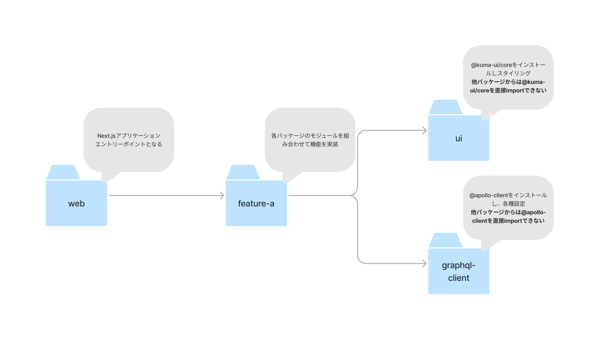

<head>
  <link rel="preconnect" href="https://fonts.googleapis.com">
  <link rel="preconnect" href="https://fonts.gstatic.com" crossorigin>
  <link href="https://fonts.googleapis.com/css2?family=Noto+Sans+JP:wght@400;700&family=Open+Sans:wght@400;700&display=swap" rel="stylesheet">
</head>

<!-- 全体のスタイル -->
<style>
  section {
    width: 1280px;
    height: 720px;
  }

  section {
    --h1-color: #323845;
    --color-canvas-subtle: #f6f8fa;
    --color-canvas-default: transparent; /* 画像のbackground-imageとして利用され、透過pngに背景色が当てられてしまうためtransparent */
  }

  section {
    font-family: 'Noto Sans JP', 'Open Sans', sans-serif;
  }
</style>

<!-- 1枚目のスタイル -->
<style>
  section.visual {
    background: rgb(232,151,63);
    background: linear-gradient(142deg, rgba(232,151,63,1) 22%, rgba(222,67,19,1) 84%);

    color: var(--h1-color);
  }

  section.visual h1 {
    font-size: 70px;
  }
</style>

<!-- 各スライドのスタイル -->
<style>
  section.slide {
    background-image: url(./images/bg.png);
    background-repeat: no-repeat;
    background-size: 1280px 720px;
  }

  section.slide {
    padding: 60px;
    padding-top: 120px;
  }

  section.slide {
    font-size: 35px;
  }

  section.slide h1 {
    position: absolute;
    left: 60px; 
    top: 50px;
  }

  section.slide ul {
    padding-left: 20px;
  }
</style>

<!-- _class: visual -->
# pnpm workspace 実践ノウハウ

Hirotaka Miyagi / @MH4GF

~ 秋のエンジニア大交流会 & LT会！！~ 2023/09/09 

---
<!-- _class: slide -->

# 自己紹介


<div style="display: flex; gap: 2em;">
  
  <div style="display: flex; align-items: center;">

- Hirotaka Miyagi / @MH4GF
- ROUTE06, inc.
- 最近はフロントエンド多め

  </div>
</div>

---
<!-- _class: slide -->

# この後話しましょう！

こんな話に興味があります！
- VRT
- GraphQL
- App Router / React Server Component
- フリーランス or 正社員 or 副業 

---
<!-- _class: slide -->

- pnpm workspace は便利ですが、実際に運用を進める上でいくつか注意点がありました
- 悩んだ点と解決方法を紹介していきます
- 汎用ライブラリ or アプリケーション / パブリック or プライベート で観点は異なるはずですが、今回は**プライベートなアプリケーションでの利用**をメインに紹介します
- workspace機能はnpm / yarnでも提供されており、それらでも適用できる内容が多いです

---
<!-- _class: slide -->

# pnpm workspace とは

- 単一の git リポジトリで複数の npm プロジェクトの統合ができる
- いわゆるモノレポを JavaScript プロジェクトで実現できる

---
<!-- _class: slide -->

# pnpm workspace の利用方法

以下の構造のアプリケーションがあるとして
```
.
├── apps/
│   ├── docs/
│   │   └── package.json
│   └── web/
│       └── package.json
├── packages/
│   └── ui/
│       └── package.json
└── pnpm-workspace.yaml
```

---
<!-- _class: slide -->
# pnpm workspace の利用方法

ルートにpnpm-workspace.yamlを置き
```yaml
# ./pnpm-workspace.yaml
packages:
  - apps/*
  - packages/*
```

---
<!-- _class: slide -->
# pnpm workspace の利用方法

サブパッケージをimportできる

```json
# ./apps/web/package.json
{
  "name": "web",
  "dependencies": {
    "next": "^13.4.19",
    "react": "^18.2.0",
    "react-dom": "^18.2.0",
    "ui": "workspace:*" # <- ui パッケージをインターナルパッケージとして参照できる 
  }
}
```

公式ドキュメント: https://pnpm.io/ja/workspaces

---
<!-- _class: slide -->
# pnpm workspace で嬉しいポイント

- 1 package.json構成と比べて ... 機能単位での責務分割ができ、中〜大規模プロジェクトでの見通しの良さに繋がる
- マルチリポジトリ構成と比べて ... 複数のパッケージの変更が1つのPRで可能, パッケージ境界の調整がしやすい

---
<!-- _class: slide -->
# pnpm workspace で嬉しいポイント



---
<!-- _class: slide -->
# 最初はcreate-turboを試すのがオススメ


```
.
├── apps/
│   ├── docs/
│   └── web/
├── packages/
│   ├── ui/
│   ├── eslint-config-custom/
│   └── tsconfig/
├── pnpm-workspace.yaml
└── turbo.json
```

ref: https://turbo.build/repo/docs/getting-started/create-new

---
<!-- _class: slide -->

# サンプルリポジトリを用意しています

- 今回紹介する内容をまとめたサンプルリポジトリを用意しています
  - create-turboから作りました
- https://github.com/MH4GF/pnpm-workspace-knowhow-sample

---
<!-- _class: slide -->
# 依存パッケージのバージョン管理

- zodなどのユーティリティ系パッケージはどこでもインストールしたくなるが、バージョンを統一したい
  - パッケージ間で微妙な挙動の違いやバンドルサイズの増加などがあると困る
- **syncpackを利用しCIで静的解析する方法に落ち着いた**

---
<!-- _class: slide -->
# 依存パッケージのバージョン管理

- 以下はtypescriptの5.1.5と5.1.6が混在していた場合の例

```shell
$ pnpm exec syncpack list-mismatches

✘ typescript ^5.1.6 is the highest valid semver version in use
  ^5.1.5 in devDependencies of packages/ui/package.json

Command failed with exit code 1.
```

---
<!-- _class: slide -->
# workspaceプロトコル

- pnpm workspaceでインターナルパッケージを依存に追加する場合は `"sub-package": "workspace:*"` や `"sub-package": "*"`が使える
  - `workspace:*` のような指定をworkspaceプロトコルと呼ぶ
- **インターナルパッケージを依存に追加する場合はworkspaceプロトコルを使うのが良い**
  - workspace内に同名のパッケージが存在しない場合エラーになってくれる
- npmにpublishされているパッケージと同名のパッケージと競合してインストールに失敗することがあった

---
<!-- _class: slide -->
# Turborepo

- 各パッケージのタスク実行を、並列実行や差分ビルドにより高速化が実現できるツール
- 各package.jsonのdependenciesを見て実行順序を自動で制御してくれる
  - 例: buildの前に依存パッケージのbuildタスクを実行する
- キャッシュを保持し、変更があるパッケージだけ実行する( == 差分ビルド)

---
<!-- _class: slide -->
# Turborepo

意識した方が良い点

- 各パッケージでのタスク名を揃える 例: 静的解析を行うタスクは `lint` に統一
- キャッシュを活かすために、あるパッケージが実行するタスクの結果はそのパッケージ内のファイルによって決まるのが望ましく、パッケージ外に依存する場合はpackage.jsonのdependenciesで定義する
- キャッシュによる事故を防ぐための仕組みがあると望ましい
  - 例: Pull RequestのCIではキャッシュを有効化しつつ、mainブランチのCIではキャッシュを無効化する

---
<!-- _class: slide -->
# ESLint / Prettier / Jestをルートで実行するか？各パッケージで実行するか？

各パッケージで実行する方法に落ち着いた
- 🙆‍♂️ Turborepoによるキャッシュが効くため、変更があるパッケージだけ実行することによる時間短縮が見込める
- 🙆‍♂️ パッケージごとに設定するruleを変えられる
- 🙅‍♂️ キャッシュを無効化して実行する場合、並列実行はできるものの起動のオーバーヘッドがかかるため時間がかかる 

---
<!-- _class: slide -->
# configsパッケージのパターン

- 開発中に利用する各種ツールの設定ファイルは、ルートに置いて相対パスやシンボリックリンクで参照することが多いが、あまりおすすめしない
- configsのような形で複数の設定ファイルをまとめて一つのパッケージに切り出すのがおすすめ

---
<!-- _class: slide -->
# configsパッケージのパターン

prettierとtsconfig.jsonの共通設定をまとめている例

```
./packages/configs
├── package.json
├── prettier
│   └── index.cjs
└── tsconfig
    ├── base.json
    ├── nextjs.json
    └── react-library.json
```

---
<!-- _class: slide -->
# configsパッケージのパターン

各パッケージでprettierの設定を取り出す

```json
# ./packages/ui/package.json
{
  "name": "ui",
  "devDependencies": {
    "configs": "workspace:*",
  },
  "prettier": "configs/prettier"
}
```

---
<!-- _class: slide -->
# @monorepo/configsパッケージのパターン

メリット
- 変更があった場合にTurborepoのキャッシュを適切に破棄できる
- シンボリックリンクや相対パスの場合ディレクトリの変更に弱いが、この場合パッケージ名が変わらなければpnpmが依存の解決をしてくれる

---
<!-- _class: slide -->
# パッケージ作成のテンプレート化

- パッケージ作成のために必要なコードを生成するジェネレータを用意しておくと便利
- 前述したESLint, Prettier, Jestのセットアップや、tsconfig.jsonの設定など
- いくつかコード生成ツールはあるが、Turborepoの `turbo gen` を利用するのが良さそうだった
  - TypeScriptで対話式入力の設定を記述できる・新規ファイル生成だけでなく既存ファイルへの加筆もできる

---

<!-- _class: slide -->

<p style="text-align: center; padding-bottom: 30px">Thank you for listening!!</p>